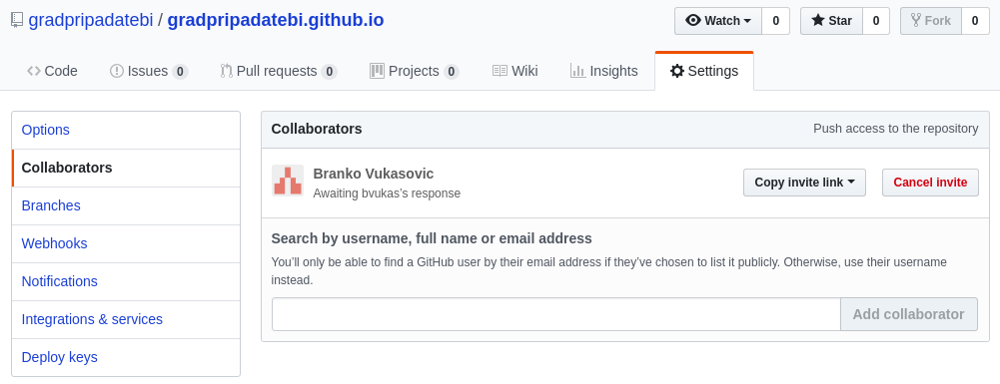
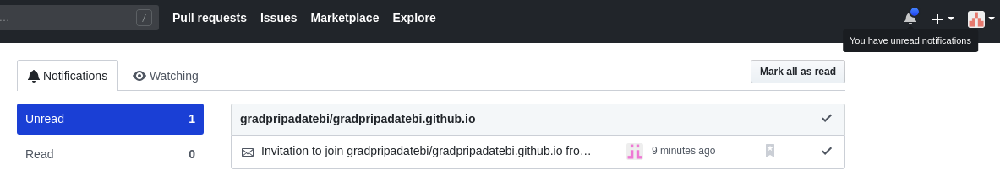
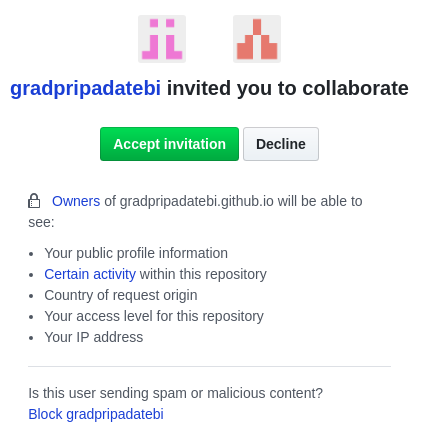
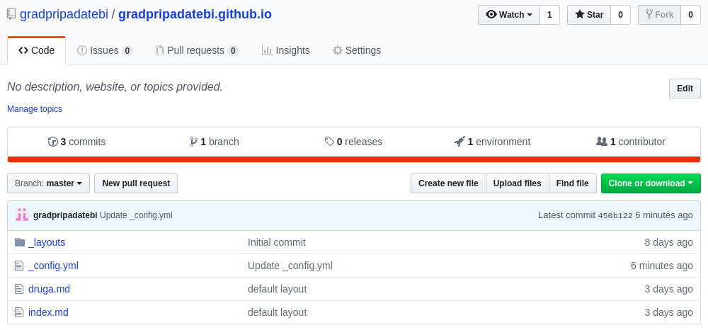
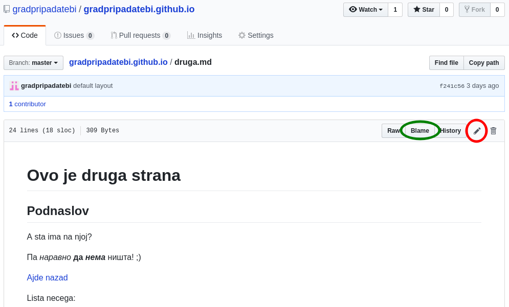
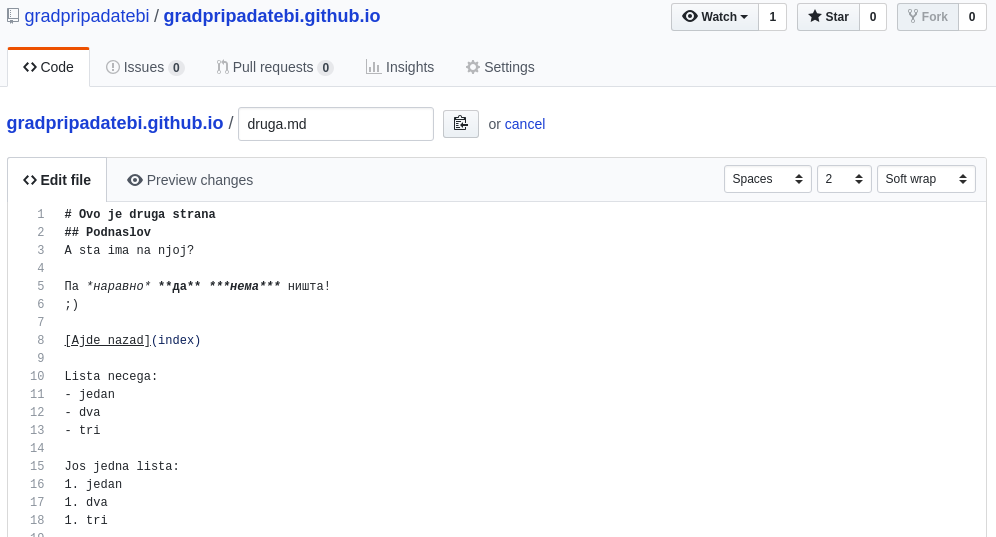
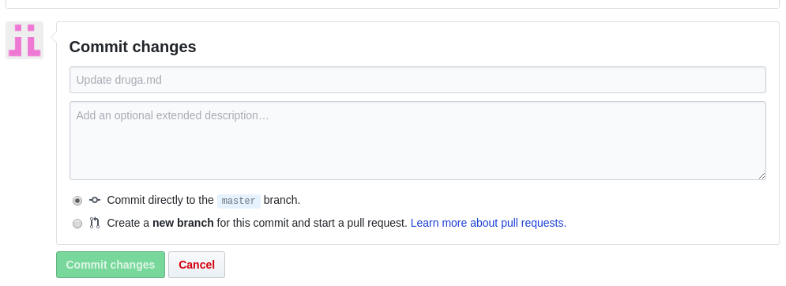

# Uputstvo za https://gradpripadatebi.github.io/

## Administracija sajta

Za ažuriranje sadržaja sajta se može koristiti i ovaj **gradpripadatebi** nalog na GitHub-u, ali je ipak preporučljivo da se koriste odvojeni nalozi. Odvojeni nalozi omogućavaju bolje praćenje istorije promena sadržaja (ko je i kada nešto izmenio), kao i kontrolu ko može da menja sadržaj. **gradpripadatebi** nalog bi trebao da služi samo za administraciju projekta, a ne za ažuriranje sardžaja. Ideja je da sve bude transparentno.

**gradpripadatebi** nalog je vlasnik dva repozitorijuma (projekta) na GitHub-u:
- uputstvo (to je ovaj repozitorijum)
- gradpripadatebi.github.io (glavni sajt)

### Dodavanje saradnika

Saradnik je neko ko ima pravo da ažurira sadržaj sajta. Saradnik, kao prvo, mora da otvori nalog na GitHub-u. Nakon toga, **gradpripadatebi** treba da doda njegov nalog u listu saradnika.

Za dodavanje saradnika treba otići na repozitorijum [gradpripadatebi.github.io](https://github.com/gradpripadatebi/gradpripadatebi.github.io), zatim izabrati **Settings** i onda **Collaborators**. Koristeći polje za pretragu pronaći nalog koji se želi dodati, i zatim kliknuti na **Add collaborator**.

Na ovom primeru se vidi da je korisnik Branko Vukasović pozvan da bude saradnik na projektu, i da se čeka njegova potvrda. Kada korisnik prihvati poziv, ima mogućnost da menja sadržaj sajta.

Pozvani korisnik će u gornjem desnom uglu videti da ima novu notifikaciju i klikom na nju može videti poruku da je pozvan da bude saradnik.

Korisnik nakon toga ima mogućnost da prihvati poziv, i nakon toga može da menja sadržaj sajta.

**gradpripadatebi** korisnik u svakom momentu može da uklanja saradnike na istoj strani gde su oni i dodati. Nakon toga, nalog više nema pravo da menja sadržaj sajta.

### Teme za razgovor (Issues)

[Issues](https://github.com/gradpripadatebi/gradpripadatebi.github.io/issues) deo bi se mogao iskoristiti za razne debate, i tu bi ostali GitHub korisnici (koji ne moraju biti i saradnici) mogli da ostavljaju svoje komentare ili predloge. Ukoliko to nije potrebno, ta opcija se moze isključiti na **Settings** strani.

## Ažuriranje sadržaja sajta

Za kreiranje stranica se koristi **markdown** sintaksa. Više o markdown sintaksi možete naći na https://www.markdownguide.org/basic-syntax

Ceo sajt se nalazi na https://github.com/gradpripadatebi/gradpripadatebi.github.io. Da bi ste mogli da ga menjate, morate se prijaviti na GitHub sa svojim nalogom koji je prijavljen kao saradnik.

U momentu pisanja ovog uputstva, prva strana je izgledala ovako:

`_layouts` folder i `_config.yml` fajl služe za konfiguraciju izgleda gotovih strana, i biće objašnjene kasnije. Pored njih se vide:
- index.md, i
- druga.md

Fajlovi sa .md ekstenzijom su dokumenti koji su vidljivi na samom sajtu.

index.md fajl je početni fajl za sajt, i on se prikazuje kada se direktno pristupi sajtu https://gradpripadatebi.github.io/
druga.md fajl je stranica kojoj se pristupa preko https://gradpripadatebi.github.io/druga

### Izmena postojećih fajlova

Klikom na fajl se otvara stranica gde se može videti izvorni kod stranice. Ukoliko fajl ima ekstenziju .md, vidi se preview fajla (otprilike kako on izgleda na samom sajtu).

**Blame** dugme otvara prikaz ko je i kada menjao pojedine delove stranice, što može ponekad biti korisna opcija.

Izmena fajla se vrši klikom na olovku.

Sada je moguće menjati sadržaj strane, i po potrebi proveriti izgled nakon izmena (Preview changes dugme). Kada ste zadovoljni izgledom, promene treba sačuvati klikom na **Commit changes** na dnu strane.

Za svaku izmenu je potrebno uneti neki komentar (ukoliko se ostavi prazan, dobiće se default komentar, npr. `Update druga.md`), i on je posle vidljiv u istoriji promena sajta.

> Uvek ostavite čekiranu opciju `Commit changes to the master branch`!

Nakon commit-a, GitHub automatski rebilduje sajt tako što fajlove sa .md ekstenzijom pretvara u klasične html strane, a ostale fajlove (slike, pdf fajlove, i slično) samo kopira, i promene su vidljive nakon nekoliko sekundi.

### Dodavanje novog fajla

Za dodavanje novih fajlova postoje dve opcije.

Prva opcija je da se sa početnog ekrana klikne na **Create new file**. Dobija se strana ista kao i za izmenu postojećeg fajla, s tim što je potrebno uneti ime novog fajla. Potrebno je da novi fajl ima .md ekstenziju da bi se normalno prikazivao na sajtu.

Druga opcija je **Upload files**. Na ovaj način možete uploadovati nekoliko fajlova odjednom, a to mogu biti slike, pdf dokumenti, ili .md fajlovi koje ste pripremili lokalno u bilo kom tekst editoru.

Da bi promene bile vidljive na sajtu, opet je potrebno kliknuti na **Commit changes**, kako i kod izmene postojećih fajlova.
